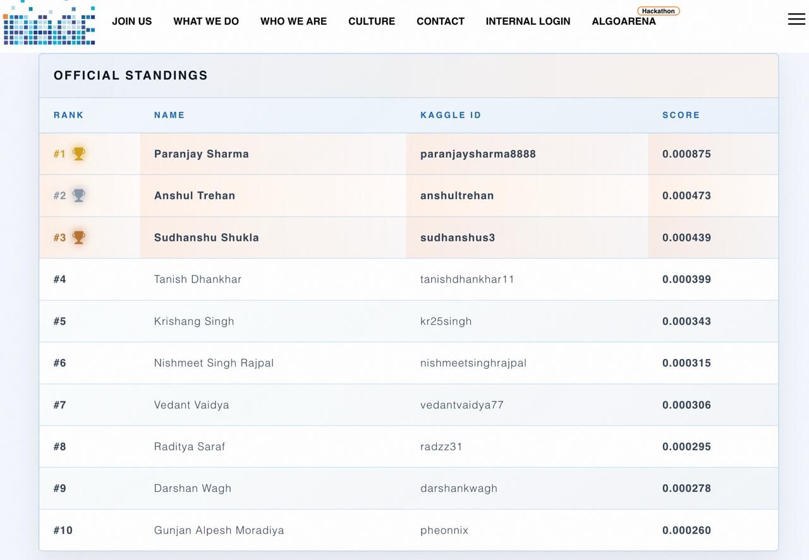

# 🏆 iRage AlgoArena 2026 — Top 10 Solution

> **Final Rank: Top 10 out of 500+ participants**
>
> Short-horizon financial return prediction using engineered temporal features and a dual-regularization LightGBM ensemble.

**Author:** Gunjan Moradiya · Final Year B.Tech CS (Data Science), DJSCE Mumbai

---

## Competition Overview

[iRage AlgoArena 2026](https://www.irage.in/) tasked participants with predicting short-horizon financial returns from hundreds of high-dimensional signals exhibiting temporal structure.

**Dataset schema:**

| Column | Description |
|---|---|
| `ID` | Unique row identifier |
| `TARGET` | Short-horizon return to predict |
| `CV_GROUP` | Temporal group label for cross-validation |
| `S01_LagT1`, `S01_LagT2`, … | Signal features — multiple signals (`S01`, `S02`, `S03`, …) each observed at multiple lags (`LagT1`, `LagT2`, `LagT3`) |

The core challenge: extract genuine predictive signal from a wide feature space where most columns are noise, while respecting the temporal structure inherent to financial data.

---

## Solution Architecture

```
┌─────────────────────────────────────────────────────────────────┐
│                      RAW FEATURES (~hundreds)                   │
└──────────────────────────────┬──────────────────────────────────┘
                               │
                    ┌──────────▼──────────┐
                    │  FEATURE SELECTION   │
                    │  |corr| with TARGET  │
                    │  Top 120 features    │
                    └──────────┬──────────┘
                               │
          ┌────────────────────┼────────────────────┐
          │                    │                     │
 ┌────────▼────────┐ ┌────────▼────────┐  ┌────────▼────────┐
 │   MOMENTUM &    │ │ INTRA-SIGNAL    │  │ CROSS-SIGNAL    │
 │  ACCELERATION   │ │ INTERACTIONS    │  │ INTERACTIONS    │
 │  (1st & 2nd     │ │ Top-20 pairwise │  │ S01×S02 (25)   │
 │   differences)  │ │ products (190)  │  │ S01×S03 (25)   │
 └────────┬────────┘ └────────┬────────┘  └────────┬────────┘
          │                    │                     │
          └────────────────────┼─────────────────────┘
                               │
                    ┌──────────▼──────────┐
                    │  COMBINED FEATURE   │
                    │       MATRIX        │
                    └──────────┬──────────┘
                               │
              ┌────────────────┼────────────────┐
              │                                 │
     ┌────────▼────────┐              ┌────────▼────────┐
     │    MODEL A       │              │    MODEL B       │
     │  (Conservative)  │              │  (Aggressive)    │
     │  α=5, λ=5        │              │  α=0.5, λ=0.5   │
     │  GroupKFold (5)  │              │  GroupKFold (5)  │
     └────────┬────────┘              └────────┬────────┘
              │                                 │
              │        ┌──────────────┐         │
              └───────►│   ENSEMBLE   │◄────────┘
                       │ 0.72A+0.28B  │
                       └──────┬───────┘
                              │
                     ┌────────▼────────┐
                     │  FINAL PREDS    │
                     └─────────────────┘
```

---

## Feature Engineering

### 1. Correlation-Based Feature Selection (→ 120 features)

Computed `|pearson_corr(feature, TARGET)|` for every raw feature, sorted descending, and kept the top 120.

**Why:** The raw feature space contains hundreds of signals, most of which are noise. In financial prediction, adding noisy features doesn't just waste computation — it actively degrades tree-based models by diluting split quality. A hard filter on univariate correlation is a computationally cheap way to retain the features most likely to carry genuine signal while discarding the rest.

### 2. Momentum & Acceleration Features

For each signal present at multiple lags in the top 120:

- **Momentum** = `LagT1 - LagT2` (first discrete difference — rate of change)
- **Acceleration** = `LagT1 - 2·LagT2 + LagT3` (second discrete difference — change in momentum)

**Why:** Raw lag values tell you *where* a signal is; differences tell you *where it's going*. In financial markets, the derivative of a signal often carries more predictive information than the level. A feature trending sharply upward (high momentum) or decelerating (negative acceleration) conveys regime information that raw lags cannot express directly. This mirrors how traders interpret price action — not just the price, but whether it's accelerating or slowing.

### 3. Intra-Signal Interaction Features (190 features)

Took the top 20 lag features and computed all pairwise products (C(20,2) = 190 features).

**Why:** Tree models find axis-aligned splits, but the true signal boundary may lie along a diagonal in feature space. Pairwise products let the model capture *multiplicative* relationships — e.g., a feature that is only predictive when another feature is in a particular range. This is especially relevant in financial signals where conditional dependencies are the norm (a momentum signal might only matter when volatility is elevated).

### 4. Cross-Signal Interaction Features (50 features)

- Top 5 `S01` features × Top 5 `S02` features = 25 features
- Top 5 `S01` features × Top 5 `S03` features = 25 features

**Why:** Different signal families (S01, S02, S03) likely capture different market microstructure effects — e.g., order flow, volatility, spread dynamics. Cross-signal products let the model detect regimes where *combinations* of signals are jointly predictive, which isolated signals cannot express. Limiting to the top 5 per group controls the feature count while focusing on the strongest cross-signal interactions.

---

## Model & Validation

### Why GroupKFold (Not Standard KFold)

The dataset includes a `CV_GROUP` column that encodes temporal structure. Standard KFold would randomly split rows, allowing the model to train on data temporally adjacent to (or overlapping with) validation rows. In financial data, this creates look-ahead bias — inflated CV scores that don't generalize to unseen time periods.

**GroupKFold** ensures that all rows sharing the same `CV_GROUP` value appear entirely in either the training or validation set, never both. This simulates the real deployment scenario: training on past data and predicting future data from unseen time periods.

**Validation:** Our GroupKFold CV scores closely matched the public leaderboard scores, confirming that the validation setup was capturing genuine out-of-sample performance rather than leaking information.

### Dual-Regularization Ensemble

| Parameter | Model A (Conservative) | Model B (Aggressive) |
|---|---|---|
| `n_estimators` | 2000 | 2000 |
| `learning_rate` | 0.02 | 0.02 |
| `num_leaves` | 128 | 128 |
| `subsample` | 0.8 | 0.8 |
| `colsample_bytree` | 0.8 | 0.8 |
| `reg_alpha` (L1) | **5.0** | **0.5** |
| `reg_lambda` (L2) | **5.0** | **0.5** |
| Early stopping | 200 rounds, `l2` metric | 200 rounds, `l2` metric |

### Ensemble Weighting: `0.72 × A + 0.28 × B`

The final prediction is a weighted average heavily favouring the conservative model.

**Rationale:** Model A (high regularization) produces smoother, more robust predictions with lower variance but slightly higher bias. Model B (low regularization) fits the training data more aggressively, capturing finer-grained patterns but at higher risk of overfitting.

The 72:28 split reflects a deliberate bias-variance tradeoff decision: in financial prediction, *stability matters more than sharpness*. Overfit predictions on financial data don't just lose accuracy — they can produce catastrophic outliers. The 28% allocation to Model B adds a small injection of additional signal from the more expressive model without letting it dominate.

---

## Results

> **Final Standing: Top 10 / 500+ participants**



---

## Key Learnings

1. **GroupKFold is non-negotiable for financial ML.** Standard KFold on time-structured data inflates CV scores by 2–5× through temporal leakage. The iRage-provided `CV_GROUP` column was a strong hint that respecting temporal boundaries was part of the problem design. Our CV-to-leaderboard alignment confirmed this.

2. **The dual-regularization ensemble works because the models err differently.** High-regularization models underfit noisy signals but remain stable; low-regularization models capture them but at the cost of variance. Blending the two produces a prediction surface that is both smooth and expressive. The ensemble's edge comes from *decorrelated errors*, not just averaging.

3. **The 72:28 weighting is the bias-variance sweet spot.** Financial return prediction penalizes large errors disproportionately. A conservative-heavy blend says: "trust the stable model by default, but let the aggressive model contribute where it sees something the stable model misses." This is consistent with how ensemble weighting typically shakes out in noisy, low-SNR financial prediction tasks.

4. **Thoughtful feature engineering > more features.** Momentum, acceleration, and interaction features are grounded in financial intuition (rate of change matters, signals interact conditionally). This beat approaches that blindly generated thousands of features — because each engineered feature had a hypothesis behind it, the signal-to-noise ratio of the final feature set stayed high.

---

## Repository Structure

```
iRage_AlgoArena_Top-10/
├── README.md                           # This file
├── requirements.txt                    # Python dependencies
├── final_irage.ipynb                   # Original competition submission notebook
├── notebooks/
│   └── solution_walkthrough.ipynb      # Annotated walkthrough with explanations
├── src/
│   ├── features.py                     # Feature engineering pipeline
│   └── model.py                        # Model training and ensemble logic
└── results/
    └── feature_summary.md              # Feature categories and counts
```

---

## How to Run

> ⚠️ **The competition dataset is proprietary and not included in this repository.**

To adapt this solution to your own data:

1. **Clone and install dependencies:**
   ```bash
   git clone https://github.com/yourusername/iRage_AlgoArena_Top-10.git
   cd iRage_AlgoArena_Top-10
   pip install -r requirements.txt
   ```

2. **Prepare your data** with the expected schema:
   - Columns: `ID`, `TARGET`, `CV_GROUP`, and signal features named `SXX_LagTY`
   - Place `train.csv` and `test.csv` in the project root

3. **Run the walkthrough notebook:**
   ```bash
   jupyter notebook notebooks/solution_walkthrough.ipynb
   ```

4. **Or use the modular source code:**
   ```python
   from src.features import select_top_features, engineer_all_features
   from src.model import run_cv, ensemble, get_lgbm_params

   top_features = select_top_features(train, target_col='TARGET', n=120)
   train_eng, test_eng, feature_list = engineer_all_features(train, test, top_features)

   params_A = get_lgbm_params(regularization='high')
   params_B = get_lgbm_params(regularization='low')

   oof_A, test_A = run_cv(train_eng, feature_list, 'TARGET', 'CV_GROUP', params_A)
   oof_B, test_B = run_cv(train_eng, feature_list, 'TARGET', 'CV_GROUP', params_B)

   final_preds = ensemble(test_A, test_B, weight_A=0.72)
   ```

---

## Requirements

- Python 3.8+
- numpy
- pandas
- lightgbm
- scikit-learn

```bash
pip install -r requirements.txt
```

---

*Built for iRage AlgoArena 2026. Solution by Gunjan Moradiya.*
